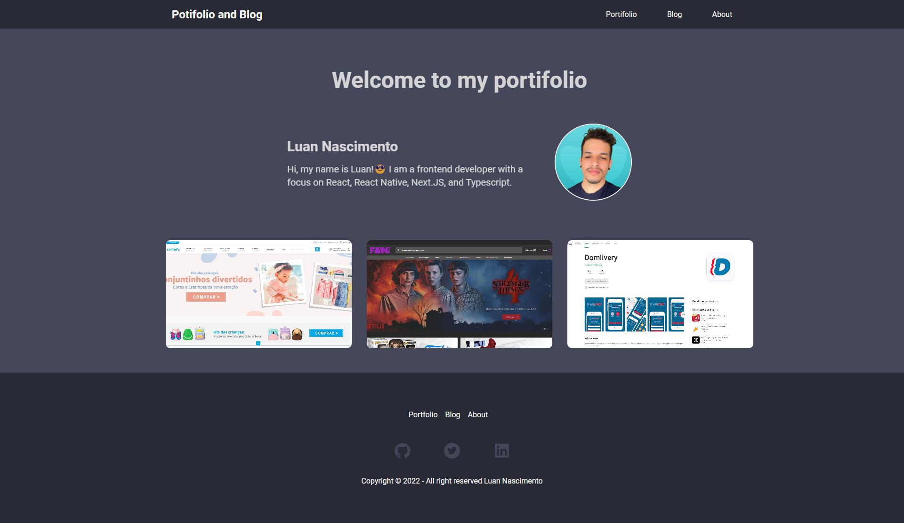

<h1 align='center'>Portifolio</h1>

<h1 align="center">
  
</h1>

## About 🚀

This is my portfolio, its made to document and show all projects that 
I have the pleasure to work with you.
I hope you enjoy.
---

## Techs ✔
- [React JS](https://reactjs.org/)
- [Vite](https://vitejs.dev/)
- [Typescript](https://www.typescriptlang.org/)
- [GraphQL](https://graphql.org/)
- [React Router](https://v5.reactrouter.com/web/guides/quick-start)
---

## How to install 💻

```bash
#First clone this project on your preference path

$ git clone https://github.com/Luan4560/personal-portifolio.git

# Then got to you path, open the project and install the dependecies.

$ yarn or npm install

# After that, just initilialize the project with:

$ yarn dev
```
---

This project was made by Luan Nascimento 🤘

<!-- ## Check result on

```https://ignite-hi92h2pyq-luan4560.vercel.app/``` -->